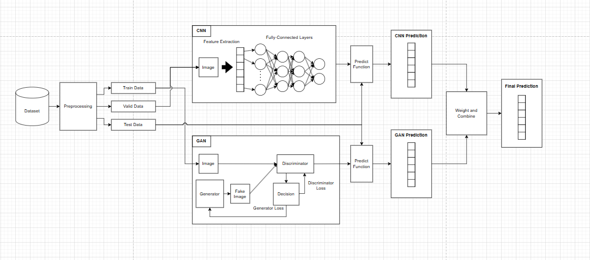

# IF4073_Deepfake_Detection
Deepfake Images Detection using CNN and GAN


## Table of Contents
* [Program Description](#program-description)
* [How to Run](#how-to-run)
* [System Architecture](#system-architecture)
* [References](#references)


## Program Description
This program contains the combination of the CNN and GAN model to detect deepfake images from the real ones. All the development of the system is done using Python and its libraries.

## How to Run
1. Download the dataset from the source (see [References](#references))
2. Put the data set inside `data` directory so the folder structure has a similar structure like this
```
data
  |- images
      |- Dataset
          |- Test
              |- ...
          |- Train
              |- ...
          |- Valid
              |- ...
```
3. [OPTIONAL] Generate .csv to list the image in the dataset. User can adjust the number of images to be listed in `src/generate_csv.py`
```bash
python src/generate_csv.py
```
4. [OPTIONAL] Build the CNN and GAN model
```bash
python src/train_cnn.py
python src/train_gan.py
```
5. Test the model
```bash
python src/test.py <arg>
# <arg> : [cnn, gan, both]

# example:
python src/test.py both
```

## System Architecture



## References
* Data Source: [Kaggle](https://www.kaggle.com/datasets/manjilkarki/deepfake-and-real-images)